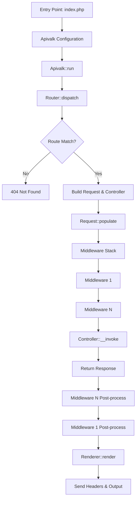

## Overview

The Apivalk request lifecycle follows a structured path involving routing, request population, middleware execution, and controller dispatching.

## Stages

### 1. Bootstrapping

The application starts by creating an `ApivalkConfiguration` object. This configuration requires a `Router` and can optionally include a `Renderer`, an `ExceptionHandler`, and a PSR-11 `Container`. The `Apivalk` instance is then initialized with this configuration.

### 2. Application Execution

Calling `$apivalk->run()` initiates the request processing. If an `ExceptionHandler` was configured, it is registered at this stage to catch any unhandled exceptions during the lifecycle.

### 3. Routing

The `Apivalk::run()` method calls `Router::dispatch()`. The router performs the following:

- Extracts the HTTP method and URI path from `$_SERVER`.
- Iterates through cached routes to find a match for the URI.
- If no URI matches, it returns a `NotFoundApivalkResponse` (404).
- If the URI matches but the HTTP method does not, it returns a `MethodNotAllowedApivalkResponse` (405).

### 4. Request & Controller Preparation

Once a route is matched:

- The `Router` identifies the specific `Request` and `Controller` classes associated with the route.
- The `Controller` is instantiated using the `ApivalkControllerFactory` (which integrates with the DI container if available).
- The `Request` object is instantiated.

### 5. Request Population

The `Request` object's `populate()` method is called. It uses `ParameterBagFactory` and `FileBagFactory` to extract data from PHP superglobals:

- **Headers**: Extracted from `$_SERVER`.
- **Query Parameters**: Extracted from `$_GET`.
- **Path Parameters**: Parsed from the URI based on the route pattern.
- **Body Parameters**: Extracted from `$_POST` or `php://input` (JSON).
- **Files**: Extracted from `$_FILES`.

### 6. Middleware Pipeline

The `MiddlewareStack` handles the request and controller. It implements an **onion-style** middleware execution:

- Middlewares are executed in the order they were added.
- Each middleware receives the `Request`, the `Controller` class name, and a `$next` callable.
- A middleware can perform actions before passing control to the next layer, or it can short-circuit the request by returning a response immediately.

### 7. Controller Dispatch

The final step in the middleware pipeline is the execution of the Controller itself. Since all Apivalk controllers implement `__invoke()`, they are called with the populated `Request` object. The controller executes the business logic and MUST return an `AbstractApivalkResponse`.

### 8. Response Rendering

The response returned by the middleware stack is passed back to the `run()` method, which returns it to the caller (e.g., your `index.php`). The developer then typically uses the configured `Renderer` to:

- Set the HTTP status code.
- Send the necessary HTTP headers (including `Content-Type: application/json`).
- Serialize the response data (and optional pagination info) to JSON and output it.

### 9. Exception Handling

If an exception is thrown anywhere during the lifecycle and an `ExceptionHandler` is active:

- It catches the `Throwable`.
- It creates an `InternalServerErrorApivalkResponse` (500).
- It uses the `JsonRenderer` to immediately send the error response and exit.